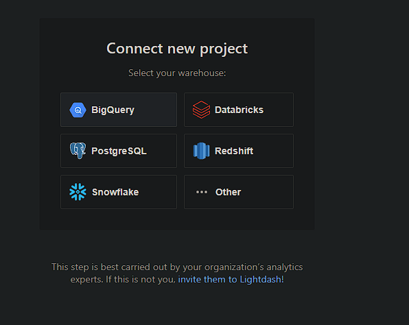

# Lightdash

## Choose your warehouse



## Select the option: Create project manually


## Select the option: I've Defined them!


## Add your warehouse connection

You need to specify your Google Project, the location and the lightdash service account key file that Terraform created.

Either it's already in your credentials folder, otherwise you can just generate it with the following command

```bash
make lightdash-credentials
```

Finally you just upload your json keyfile here.


## Connect to your dbt project

I have chosen to connect through our Github project, so you will need a Personal Access Token that you can create specifically for this Lightdash isntance.

You're going to need the dbt project path under your github repository, the dbt profile target and the bigquery dataset of the target.


And that's it, you're good to go.
